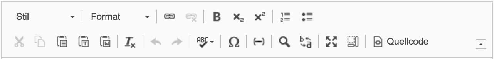

Back to [Index](../Index.md)

---

# CKEditor improvements and defaults

This TYPO3 distribution comes with some really useful real world scenario presets. It also ships some custom modifications
with external plugins and a custom project specific plugin to limit the tables plugin.

> **Extending/Adopting the CKEditor in TYPO3 is easy and makes fun – Try it out or check out my custom built CKEditor plugins in this TYPO3 distribution!**

- [Predefined CKEditor presets](#overview-of-shipped-ckeditor-presets)
- [Additional 3rd party CKEditor plugins](#additional-3rd-party-ckeditor-plugins)
- [Custom CKEditor plugins](#custom-ckeditor-plugins)

## Overview of shipped CKEditor presets

| Preset key               | Extend from     | Description                                                                       |
|:-------------------------|:----------------|:----------------------------------------------------------------------------------|
| `theme_default`          | -               | Default CKEditor configuration                                                    |
| `theme_defaultNoTables`  | `theme_default` | Disables table plugin                                                             |
| `theme_minimal`          | -               | Very minimal preset (as a base for other minimal custom project specific presets) |
| `theme_minimalWithLinks` | -               | Very minimal preset with link support                                             |

### The configuration could be found inside `EXT:theme`

- `EXT:theme/Configuration/TSConfig/Page/General/RTE/` → PageTSConfig to assign available presets
- `EXT:theme/Configuration/RTE/` → Every yaml file represents a preset
- `EXT:theme/Configuration/RTE/Additional` → Every yaml file inside this subfolder is inteded to be imported into final CKEditor presets
- `EXT:theme/ext_localconf.php` → `$rtePresets` array reflects all available custom CKEditor presets. (This is where the presets gets registered in TYPO3.)

### theme_defaultNoTables

## Additional 3rd party CKEditor plugins

| Name                                                                | Description                                                                        | Usage                                                                                                    |
|:--------------------------------------------------------------------|:-----------------------------------------------------------------------------------|:---------------------------------------------------------------------------------------------------------|
| [wordcount](../../Images/ckeditor-demo-plugin-wordcount-180325.png) | [WordCount GitHub Repository](https://github.com/w8tcha/CKEditor-WordCount-Plugin) | Activated in all CKEditor presets. Could be used to limit content length (for specific CKEditor presets) |

## Custom CKEditor plugins

| Name                                                                                              | Description                                                                                                                                                                | Buttons                                                                                         | Usage                                                        |
|:--------------------------------------------------------------------------------------------------|:---------------------------------------------------------------------------------------------------------------------------------------------------------------------------|:------------------------------------------------------------------------------------------------|:-------------------------------------------------------------|
| [deleteall](../../../Resources/Public/RTE/ProjectPlugins/deleteall/plugin.js)                     | Button to clear/reset whole CKEditor content with one click                                                                                                                |     | Activated in all CKEditor presets                            |
| [nbsp](../../../Resources/Public/RTE/ProjectPlugins/nbsp/plugin.js)                               | Insert `&nbsp;` with keystroke "CTRL + Space"                                                                                                                              |                                                                                                 | Activated in all CKEditor presets                            |
| ~~softhyphen~~ (My custom plugin was already merged into the TYPO3 CMS core (8.7.17, 9.3.1, 9.4)) | Insert Softhyphen character `&shy;` with button and "CTRL + - (Dash)". The shortcut can be deactivated.                                                                    |  | Activated in all CKEditor presets                            |
| [tableModifications](../../../Resources/Public/RTE/ProjectPlugins/tableModifications/plugin.js)   | Limit/Modificate table dialog of CKEditor table plugin. **Treat the current configuration only as a starting point for your specific project** and adopt it to your needs. |                                                                                                 | Activated in all CKEditor presets with enabled table plugin. |
